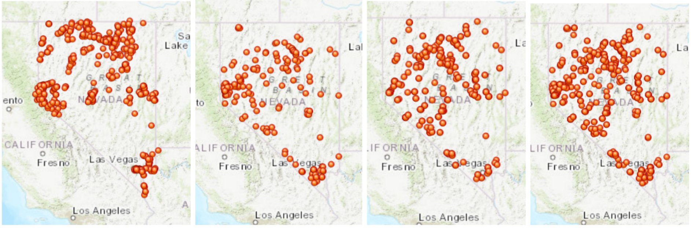
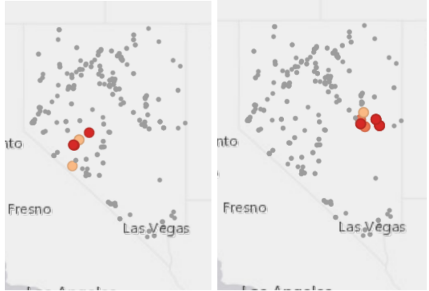
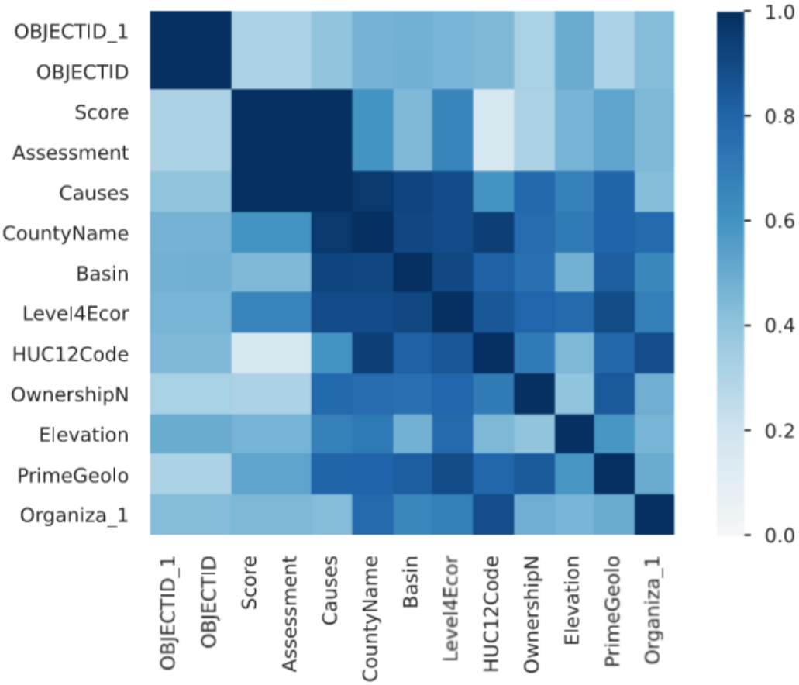

# Mines and Water Quality in Nevada: A GIS Analysis

The data used in this project is contained in `project.gdb`. The code along with additional commentary and some outputs can be found at `project_notebook.ipynb`. In order to run the code as written, you will need access to Esri software (ideally Jupyter Notebooks in ArcGIS Online) and some computing power. The writeup and code are from Fall 2022, and thus may be out of date with current information.

Mining is essential to Nevada’s economy, but the impacts it has on the environment go under-appreciated. In an attempt to determine to what extent the proximity of a mine has environmental effects, specifically on water quality, in the state of Nevada, I do hotspot and correlation analysis on datasets of mines and water quality. I also document the challenges I experienced throughout the project, including an error even Esri can’t reliably solve. While this initial analysis does not return much of interest, the journey helped me develop important skills using the ArcGIS API for Python.

## Introduction
There were 161 mines in Nevada with some kind of activity in 2019. Of those, [40 were gold mines](https://www.arcgis.com/home/item.html?id=826bb580b0a44bbbbc85d46133746747). Mines were key to establishing Nevada as a state, and continue to be essential to the state’s economy. [Mining is the state’s largest export industry](https://goed.nv.gov/key-industries/mining/), it provides the [highest average salary in the state](https://www.nevadamining.org/mining-in-nevada/), and Nevada is home to the [only major lithium mine in the United States](https://www.theguardian.com/us-news/2022/oct/18/lithium-mining-nevada-boom-car-battery-us-climate-crisis). It is difficult to overstate how central mining is to Nevada’s history, economy, and identity. But the industry does not come without its downsides, and it leaves a long trail of environmental consequences in its wake.

## Literature Review
One of the most prominent effects mining has had is on water quality. Toxic releases from mining are [especially a problem](https://www.epa.gov/trinationalanalysis/metal-mining) in Nevada because of the quantity of gold, silver, and zinc mining in the state. Gold mines have been found to [have an effect on groundwater](https://doi.org/10.1016/j.aca.2004.06.073), resulting in high acidity and high metal concentrations near tailings. The only Superfund site in Nevada is the [Carson River Mercury Superfund site](https://ndep.nv.gov/uploads/water-wqm-docs/QAPP_FINAL_2020.pdf), also a consequence of ore processing from mines in the area.

The historic consequences of mining, specifically from gold mines, can be seen in the forty waterbodies identified as not supporting consumption of fish due to mercury in the water dataset used in this project. According to the [Nevada 2020-2022 Water Quality Integrated Report](https://ndep.nv.gov/uploads/water-wqm-docs/IR2022FINAL_Report.pdf) the data was produced for, “most of the waterbodies with mercury-impaired fish reflect legacy pollution from historical mining operations where mercury was used during the processing of gold ore.” Groundwater contamination isn’t the only concern. The tailings from mines [“are associated with the surface impacts which greatly affect surface and ground water quality”](https://doi.org/10.3390/ijerph13111047). While mines have to abide by higher environmental standards now than they did in the early days of the state, the legacy of mining pollution looms large in Nevada.

## Methodology
### Organizational Understanding
#### Organizational Objectives
This semester, a non-profit I’ve worked for in the past approached me with an idea for a GIS project. The project as initially proposed was creating a gold mine tracker for the state of Nevada that includes all current and proposed gold mines, which is a resource that doesn't yet exist. One of the goals of the non-profit is to decrease the number of new gold mines in Nevada as much as possible, and having good, spatially organized data about current and proposed gold mines would be a great resource for that goal.

Over the course of the project, my objectives evolved as I discovered what was and wasn’t possible for me to do with the data and time that I had. My focus widened from just gold mines to all mines, active and historical. My initial goals, based on what the non-profit requested from me, were as follows:

**Objective 1.** Create a reference map in ArcGIS Pro that contains the locations of all existing gold mine sites and some data associated with them. Share this map with the non-profit. Extension: Add proposed gold mine sites.

**Objective 2.** Gather data on a specific aspect of the possible effects of gold mines and perform analysis to determine if a correlation exists between proximity to a mine and the other data point, and if so, what is its nature. This analysis will likely focus on water quality due to the availability of data. Extension: Investigate an additional data point.

**Objective 3.** Create a web app in ArcGIS Web AppBuilder that presents the reference map and my analysis and allows users to filter information about the gold mines via layers. Extension: Make this web app public in collaboration with the non-profit.

My goals for further work, specifically coordinating with the non-profit and meeting their needs, were to include proposed gold mine sites on the reference map, build out a more robust dataset about the existing and proposed mines, sharpen the data analysis so it can be used by the non-profit, and make the web app public.

After assessing the situation, I updated my success criteria for this project to, by the end of the semester, have completed Objective 1 (reference map with existing gold mine sites with minimal associated data), Objective 2 (basic correlation analysis with another dataset using a few methods from class), and enough of Objective 3 to be able to coherently present it back to the class. As you will see throughout this paper, these objectives continued to evolve as I handled challenges.

#### Academic Objectives
My research question was to what extent does the proximity of a mine have environmental effects, specifically on water quality in the state of Nevada. In addition to the interest in helping the non-profit, I myself am interested in and have worked on mining policy. I think that it’s important to have better data on the effects of mines. Nevada’s economy is controlled mainly by tourism and mining, and therefore there exists very little political support for doing anything that might impact the success of mining operations. I think this makes it more difficult for communities to have real input in the decisions that affect their local environment, and makes the state rather unlikely to investigate the environmental effects of mines.

### Understanding the Data
#### Mines Data Description
The two mines datasets for this project were found through the tool [Nevada Mineral Explorer](https://nbmg.maps.arcgis.com/apps/webappviewer/index.html?id=e279fb2d805945b59dea1cf661f5b4e6 ). This tool was created by the Nevada Bureau of Mines and Geology, University of Nevada Reno. It was later changed to remove much of the data from view, including the active mines dataset used in this project. That dataset can still be downloaded from the tool, but not viewed in it.

The first of the two mining datasets I used was the Active Mines and Energy Producers 2021 dataset, which can be found on [ArcGIS Online](https://www.arcgis.com/home/item.html?id=826bb580b0a44bbbbc85d46133746747). This dataset was created by the Nevada Bureau of Mines and Geology. It contains names, locations, operators, commodities, and counties for mines that had activity in 2021. The second mining dataset I downloaded was Historic Production, which can be found on ArcGIS Online under the name [Production of Minerals in Nevada 1987-Present](https://www.arcgis.com/home/item.html?id=9ee00802ed9544ee9850d6510e8d5885). This dataset was created by the Nevada Division of Minerals. It contains the names, locations, commodities, and production in tons by year from 1987 to 2019.

#### Water Data Description
The water data I used was collected as part of the [Nevada 2020-2022 Water Quality Integrated Report](https://ndep.nv.gov/uploads/water-wqm-docs/IR2022FINAL_Report.pdf) prepared by the Nevada Division of Environmental Protection, Bureau of Water Quality Planning. It can be downloaded from [their open data website](https://data-ndep-gis.opendata.arcgis.com/search?q=2022&amp;tags=bwqp). The first dataset was called just [Assessment 2022](https://data-ndep-gis.opendata.arcgis.com/datasets/f9b1a5a981694d879148e414da5686f8_0/about), and it contains assessments of the water quality of the waterbodies that were measured. The waterbodies are identified with and the assessments are split up by various uses. The second dataset, [BWQP Assessed Sample Sites 2022](https://data-ndep-gis.opendata.arcgis.com/datasets/1872ab5db02e4e0081a74246b9b43c64_0/about), contains the codes, names, and locations the samples were collected from, as well as administrative information, geologic information, and hydrographic information.

#### Data Exploration
Now that I’d looked through the data on the web viewers of the various sources, I downloaded it and brought it into a notebook. This was the first major hurdle. I struggled a bit with the file system management in ArcGIS Online, and failed to organize things properly the first few times, but eventually I was able to set up the folders how I wanted, import the data, and unzip everything. I did my best to keep track of where everything was by making variables for the various paths. This became difficult and unwieldy as I kept changing the organization, but it’s something I cleaned up in the final product and something I’ll try to be better about in future work. Eventually, I elected to just upload it into My Content and import the data from there, sidestepping the file management issues going forward.

My initial approach did not involve a GeoDatabase, as I hoped I could just work directly with the data I’d imported by transforming them into spatial dataframes. I made decent progress exploring the data in this format, and I got to know what kind of issues I might encounter and what sort of cleaning I would have to do.

For the mines data, the most pressing issue was that many mines that were in the historical dataset also appeared in the active mines dataset, but they appeared under different names and with slightly different locations. In order to have a single layer of mine information, these datasets would need to be combed through for duplicates. Additionally, there were discrepancies between the two datasets in terms of how names were recorded and what ID information was available. The active mines listed the name and operator of the mines separately, while the historic mines dataset included just a single variable “Opname”. The historic mines dataset included valuable yield data from 1987 to 2019 in tons, but the active mines dataset had no yield data at all. There was no apparent key to merge the data, so dealing with duplicates and non-standard data collection would be a problem.

For the water data, the first and most obvious issue was that the water quality data did not come with location data. Instead, the waterbodies were assigned codes, and these codes were also present in the sample sites dataset. There, they were listed with location data, as well as names and other important information. When I dug into the data more, I realized that the sample sites data was pretty messy and, in addition to many variables with poorly organized data, included more than one location for many of the waterbody codes. This was of concern, because I was hoping to have one data point per waterbody to allow me to do better analysis, and I didn’t know how to fix the multiple locations problem.

Additional problems presented themselves as well. The assessment dataset reports if a waterbody fully supports or does not support a particular use. If it doesn’t support the use, a cause is recorded, usually some kind of contaminant(s). However, not every waterbody has records for all uses. Also, some assessments are recorded as not measured or insufficient information.

#### Data Quality
After I realized I didn’t fully understand what the water datasets were conveying or how they were collected enough to make an informed decision on how to solve the multiple locations problem, I reached out to the department that put together the report the datasets were created for. The Nevada Department of Conservation and Natural Resources person I communicated with put me in touch with an environmental scientist and supervisor at the Bureau of Water Quality Planning. When I called him, he helped me understand that the water quality assessments were made based on all the data collected from the waterbody. Therefore, I could merge the datasets and have the one water quality assessment collection attached to each of the sample sites without misrepresenting the data. Additionally, he explained that some of the discrepancies in what data was reported were because if the agency didn’t have enough data for a certain waterbody, they would carry forward assessments made in previous years with slightly different collection approaches, or would get information from a different source.

### Preparation of the Data
For information on how I tidied the data, please refer to my notebook.

#### Dataset Description
After my imports and tidying, I had three tables. The water table included the codes, names, counties, basins and other geographic designations, ownership, elevation , geologic era and soil composition, numeric contaminants, water quality attainment categories, assessments, causes, and numeric water quality scores for the waterbodies measured. The active mines table included the name, operator, commodity, county, and location of the mines active in 2021. The historical mines table included the name, commodity, location, and yield in tons per year from 1987 to 2019.

### Analysis
I did spend a lot of time on the data preparation phase, so my modeling phase didn’t include much. First, I attempted to just create feature layers with the spatial dataframes and map them with the GIS map feature. I created one map for each of the mines datasets, one map that included both of the mines datasets even though it also included duplicates, and one map with the merged water quality dataset. This worked in some cases, but sometimes revealed many of the variables were missing from the attribute table; this error will be discussed in the evaluation section.

_From left to right: Water, Active Mines, Historical Mines, All Mines_

After I’d decided the datasets were as tidy as I was going to be able to get them, I reviewed my goals for the analysis portion and went back through the notebooks we’d learned from during the course. I selected hotspots. It was also recommended that I run a Pandas Profiling Report.

I calculated hotspots for the historic mines dataset. I created two maps that showed the hotspots for largest yield in 1987 and in 2019. Because the dataset is so wide, I suspect this is less a hotspot and more that these were the only mines producing anything those years, but it does show that the highly productive mining districts may have shifted over those 30 years.

_From left to right: 1987 and 2019 output_

I also ran a Pandas Profiling Report on the water dataset. This allowed me to see histograms of the variables, which revealed a few interesting things about the data (for instance, the waterbodies were privately owned by a wide margin, with the second largest owner being the forest service). It also showed me a Phik correlation matrix which unfortunately didn’t reveal much in terms of what was correlated with the water quality score, but did show that there might be a correlation between what county, basin, and ecoregion (so, general location) a waterbody was in, and what the assessment causes were.

_Correlation Matrix from Pandas Profiling Report. Note the intersection of “Causes” and “CountyName”, “Basin” and “Level4Ecor”_

I presented this analysis and a cleaned up notebook to the class. I also communicated about my progress with the non-profit, allowing me to move on to the evaluation stage.

## Evaluation
### Assessment of Results
Upon reviewing what I was actually able to complete, in contrast with what my initial stated goals were, I reworked my objectives to be the following:

1. Create a reference map that contains the locations of current and historical mines
2. Gather data on water quality and perform analysis to determine if a correlation exists between proximity to a mine and water quality
3. Present this information to the class and the non-profit to determine next steps

These objectives reflect that, as I got to know the availability of data and what I would be capable of achieving, my focus changed. In the first objective, I updated my focus from just gold mines to all mines in Nevada, including formerly active mines. While the mining datasets did include which commodity the mines produced, I did not feel it would be useful to narrow my focus to just one type of mine when there weren’t that many data points to begin with. Instead of specifying that my reference map would be created in ArcGIS Pro, I found that I was able to create it just fine in my ArcGIS Online notebook. In the second objective, I narrowed my focus to be specifically about water quality. In the third objective, I recognized that I wouldn’t be able to create a web app by the end of the course, so I changed my communication goal to just be a presentation. Because I didn’t create a web app, I was unable to do a usability evaluation.

Regarding my success in reaching these updated objectives, I was able to create a reference map that contains the locations of current and historical mines. I was not able to remove duplicates between the two datasets. The symbology is also not very informative and the map would need more work in order to be useful to the non-profit or other people.

I was able to gather data on water quality, and with the Pandas profile function, I was able to do some analysis on it. The most interesting part of the analysis was the appearance of a correlation between general location and assessment cause. I would have to do further exploration of the data to make sure this is a genuine correlation and not created by confounding factors. I was not able to determine if a correlation exists between proximity to a mine and water quality, mostly because I was not able to add a data point about proximity to a mine to the water quality dataset. 

I did present the information to the class, and I hope that my presentation communicated both some of the challenges I experienced in the data preparation phase and what analysis I was able to do. Additionally, I reached back out to the non-profit and updated them on my progress. I’ll discuss this further in the Conclusion section.

### Review of Process
As shown in the assessment of the results in regards to my objectives, I do not feel like my analysis showed what I wanted. The analysis I did, namely the water quality Pandas Profiling Report and the mining production hot spot analysis, wasn’t particularly rigorous or relevant to the goals of the project.

Regarding the process, I definitely got held up in data preparation far more than I anticipated. I know that it’s common to say that the majority of the data science process is in the data cleaning phase, but I hadn’t realized it was to this degree before the project. Had I known what I was getting myself into, I would have started data preparation before Thanksgiving Break, which may have allowed me to troubleshoot more of the issues I ran into, or start fresh with entirely new data. The issues I faced with my data were not necessarily impossible to overcome on their own, but together they made it very difficult to move past the data preparation phase. 

#### Data Constraints
For the water data, the lack of location data for the water quality information was a thorn in my side until I spoke with someone from NDEP and realized I could just merge the data as it was. Even after removing much of the unhelpful data from the sampling sites dataset, there were issues (for example, the Elevation data was not recorded for a large part of the dataset).

The way the water quality data was organized meant it was hard to come up with standardized scores for analyzing - with such a wide range of measurements taken at the different locations, I struggled to come up with a way to represent whether a waterbody was actually contaminated or not. I was able to turn their categorical data into numerical scores, but I was unable to create the kind of single score per waterbody format I wanted. The categorical cause data was interesting, but not standardized enough to do analysis with.

Once I’d merged the water datasets and tidied it the way I wanted, I was unable to turn the spatial dataframe into a feature layer. When I did, I got the error “The operation was attempted on an empty geometry,” and when mapped, the feature layer revealed it was missing many of the variables. [According to Esri](https://pro.arcgis.com/en/pro-app/latest/tool-reference/tool-errors-and-warnings/160001-170000/tool-errors-and-warnings-160101-160125-160111.htm), “while this error can occur, it occurs so rarely that the typical causes have not been identified so no solution is available at this time.” Despite my best efforts and help from several sources, I was unable to reliably fix this. One of my next steps is to figure out how to reproduce it in another notebook so I can share this with Esri via their feedback form. This error made it pretty much impossible to do spatial analysis of the water quality data.

The mine data was less fraught, but the duplication issue stood out to me fairly early in the process and I was never able to solve it. I wish that, like the water data, I had been able to find datasets that were created by the same department which would have allowed me to merge them easier

#### Other Constraints
On a long enough timescale, I’m sure I would have found ways to fix or work around these problems. I would have liked to attempt to tidy the additional data in the sample sites dataset that I removed, and integrate it into my analysis somehow. I would have liked to build some domain knowledge of what the various water quality assessment causes actually meant, so I could come to some conclusions from that data and maybe even create my own scoring algorithm. I would have liked to merge some of the attainment categories, as plenty of them were only measured at a handful of sites or were very similar in type.

Lastly, and most importantly, given more time I would have hopefully been able to do more interesting analyses with the data. If I was able to bring in some way to measure proximity to a mine, I would have hoped to show some kind of correlation between that and the waterbody's water quality. Once I’d done that, I was hoping to do some more detailed watershed analysis. The non-profit also seemed interested in the effects of mines on employment and wage information; had I had more time to explore the available data I would have liked to extend my analysis to include that or another dataset. I also wanted to eventually turn this into a public-facing tool; the initial goal was to create something that allowed communities affected by mines to have better access to information. If I’d been able to get more analysis done, I would have liked to make it visible via an interactive web map.

## Conclusion
The non-profit initially came to me interested in a gold mine tracker that would show existing gold mines, proposed new gold mines, and proposed expansions of existing gold mines. Additionally, it would collect data points related to environmental justice and ecological preservation. They wanted it to be interactive, easily usable by the communities that are impacted by mining. The goal was to help communities become aware of when projects are proposed or expanded, to help fill the gap in the existing public input process and allow them to advocate for themselves in a more informed way.

This project allowed me to build my skills in the ArcGIS API for Python, data cleaning, exploratory data analysis, spatial data science, and data communication through Jupyter Notebooks. While the project did not meet all my initial goals, it was still a beneficial learning experience.
